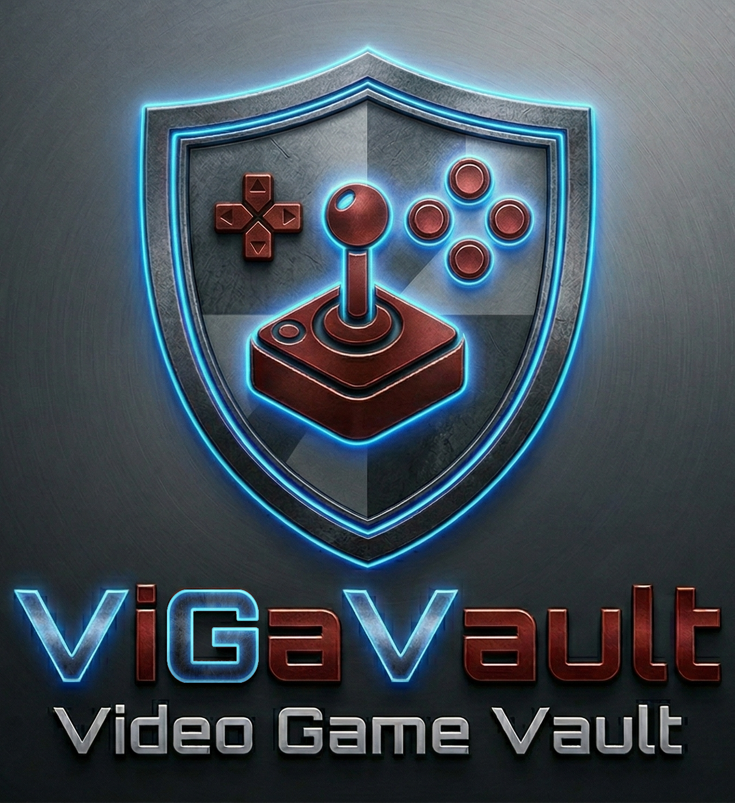
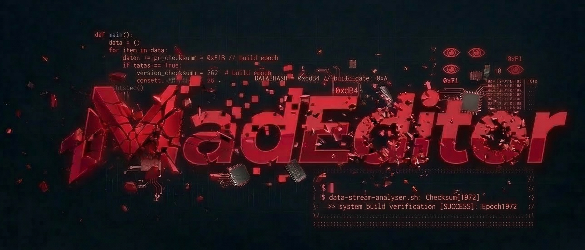

<p align="center">
  
</p>

# ViGaVault (Video Game Vault)

**ViGaVault** is a high-performance, offline-first, unified video game library manager for Windows. It provides a single pane of glass to aggregate, manage, and explore your entire digital and local game collection with forensic precision.

Designed with a focus on speed, data ownership, and a clean, customizable UI, ViGaVault fetches rich metadata and media for your games while keeping your database entirely local and under your control.

---

## What It Can Do (Current Features)

*   **Multi-Platform Aggregation**: Natively scans and merges libraries from **Steam**, **GOG.com**, **Epic Games Store**, and the local **GOG Galaxy** database.
*   **Intelligent Local File Scanner**: Advanced local folder scanning with customizable, per-folder rules. Automatically injects metadata (Genres, Collections, Years) based on your physical folder structure.
*   **Automated Deduplication & Merging**: Employs a fuzzy-logic matching engine (`difflib`) to intelligently identify the same game across different platforms, merging them into a single definitive entry with combined platform tags.
*   **Rich Metadata Scraping**: Integrates with the **IGDB API** (via your own developer key) to automatically backfill missing developers, publishers, release dates, summaries, and high-quality vertical cover art for your entire library.
*   **Advanced Scoring Algorithm**: The IGDB scraper uses a tiered, weighted scoring algorithm to find the best metadata match. It prioritizes Name, Release Year, and Developer/Publisher to ensure extreme accuracy, using media availability purely as a tie-breaker.
*   **Media & Trailer Management**: Automatically downloads and caches cover images locally for offline viewing. Extracts and plays YouTube or MP4 trailers directly from the application. A dedicated Media Manager allows for manual import and repair of missing assets.
*   **Dynamic Filtering & Search**: Filter massive libraries instantly using Excel-style multi-select dropdowns (by Genre, Platform, Publisher, etc.) that dynamically populate based on your library's content. The search bar supports targeting specific fields like Developer or Summary.
*   **Batch Operations & Data Integrity**: A dedicated Game Manager for batch editing metadata, batch deleting games, and managing custom exclusion lists (e.g., hiding DLCs or Soundtracks). A built-in file verification tool detects and corrects discrepancies between your database and physical disk.
*   **Deep Statistics & Reporting**: Generates interactive dashboards visualizing your library's KPIs—top platforms, most common genres, oldest/newest games, media completion ratios, and more.
*   **Highly Customizable UI**: Built with **PySide6 (Qt)**. Features fully customizable element scaling (images, buttons, text), native Dark/Light themes that respect OS settings, and localized translations (English, French, German, Spanish, Italian).

---

## How It Works (Under the Hood)

ViGaVault is built on **Python** using the **PySide6 (Qt)** framework for a responsive, multi-threaded GUI, and **Pandas** for lightning-fast in-memory data manipulation.

1.  **Authentication (BYOK & OAuth2)**: For maximum security and stability, ViGaVault uses a "Bring Your Own Key" model for IGDB and Steam, connecting directly to their official APIs. For GOG and Epic, it uses a secure OAuth2 flow with automatic token refresh, ensuring you only have to log in once.
2.  **Scanning & Parsing**: Background threads (`QThread`) orchestrate all data fetching to keep the UI 100% responsive. It uses a mix of official RESTful APIs (Epic, GOG, Steam) and local SQLite database parsing (GOG Galaxy) to pull ownership data.
3.  **Data Enrichment**: Games are initially flagged as `NEW`. A background Scrapper engine then queries IGDB, utilizing the tiered scoring algorithm to find the perfect metadata match before promoting the game status to `OK`. A circuit-breaker pattern prevents infinite loops on games with no available data.
4.  **Local Storage**: Your entire library is saved to a flat, human-readable `VGVDB.csv` file, making it completely portable and easy to view or edit outside the application. All application and library-specific settings are stored in local `.json` files.

---

## Future Roadmap (What's Next)

ViGaVault is actively evolving. Key planned features include:

*   **Migration to SQLite**: Transitioning the core database backend from CSV to SQLite. This will improve data integrity, handle even larger libraries more efficiently, and allow users to utilize tools like *DB Browser for SQLite* for manual administration.
*   **Expanded Storefront Integrations**: Implementing native scanners for additional platforms currently stubbed in the UI, such as Amazon Games, Ubisoft Connect (Uplay), Battle.net, and the EA App.
*   **Mobile Version**: The ultimate goal is to create a fully autonomous Android version for library management on the go.

---

## Installation & Setup

### Requirements
*   Python 3.10+
*   Required packages:
    ```bash
    pip install PySide6 pandas requests
    ```

### Running the Application
1. Clone the repository.
2. Install the required packages.
2. Run the main UI entry point:
    ```bash
    python ViGaVault_UI.py
    ```
4. The application will guide you through the first-time setup process to connect your accounts and configure your local library paths.
5. Click **SCAN** on the right sidebar to start building your vault!

---

## License / Copyright

This project is licensed under the MIT License - see the license file for details.

<p align="right">
  
</p>